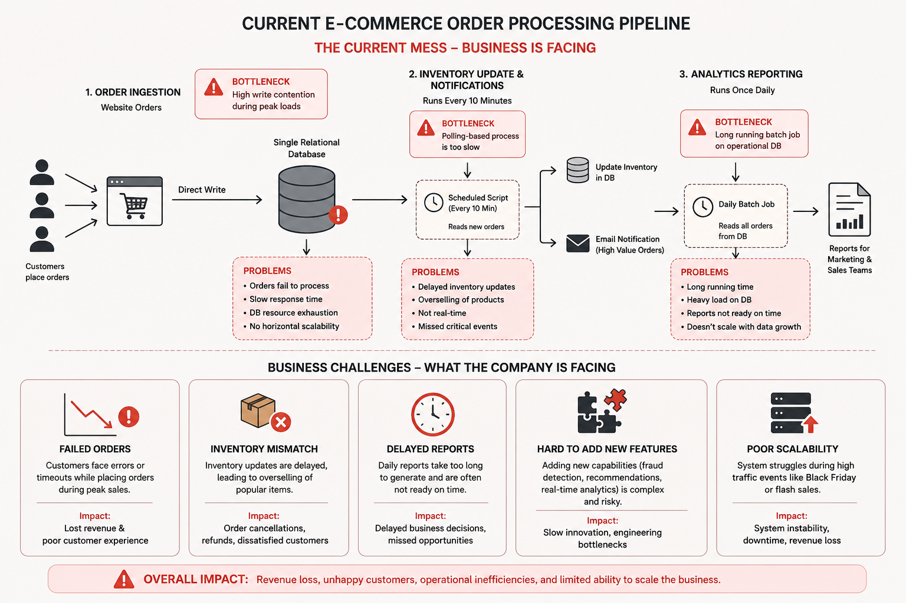

# From Monolith to Event-Driven Architecture: Scaling an E-commerce Data Pipeline

## Problem Statement

### Background

A fast-growing e-commerce company processes thousands of customer orders daily through its online platform. Initially, the company operated with a simple monolithic data pipeline architecture that handled order ingestion, inventory updates, customer notifications, and analytics reporting using a single relational database and scheduled batch scripts.

At an early stage, the system performed adequately because transaction volumes were relatively low and operational workloads were manageable.

However, as the business expanded and customer traffic increased during seasonal campaigns, flash sales, and major shopping events such as Black Friday, the platform began experiencing significant scalability and performance challenges.

### Existing Pipeline Architecture

The existing order processing workflow operates as follows:

1. Customer orders are written directly into a relational database.
2. A scheduled script runs every 10 minutes to:
   - read new orders,
   - update inventory,
   - send high-value order notifications.
3. A daily batch job processes historical data to generate reports.

While this architecture was sufficient during the company’s early growth stage, it became increasingly inefficient as transaction volumes scaled.

### Business Challenges

During high-traffic events, the company experienced:

- Failed orders due to database contention
- Delayed inventory synchronization
- Overselling of popular products
- Long-running analytics jobs
- Slow report generation
- Difficulty integrating new real-time features
- Reduced system scalability during peak traffic

As a result, the company required a more scalable, resilient, and extensible data pipeline architecture capable of supporting increasing workloads and future business growth.

### Key Scalability Concerns

- Single point of failure
- Tight coupling between services
- Polling-based processing
- Lack of horizontal scaling
- Shared operational and analytical workloads
- No event-driven communication layer
- Limited fault tolerance

### Project Objective

The objective of this case study is to analyze the scalability limitations of the existing e-commerce data pipeline and propose a redesigned architecture that improves:

* scalability,
* reliability,
* fault tolerance,
* processing speed,
* extensibility,
* and real-time data processing capabilities.

The proposed solution will focus on transitioning from a tightly coupled monolithic pipeline to a more distributed and event-driven architecture capable of handling high-volume transactional workloads efficiently.
