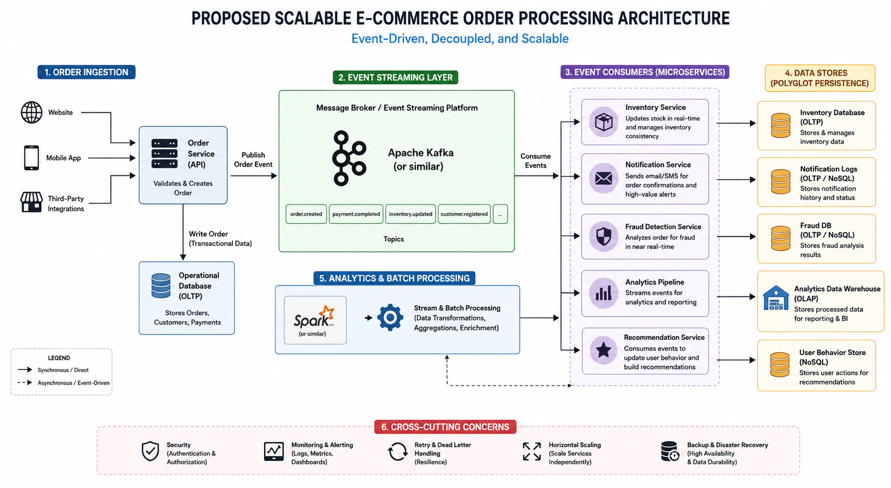

# From Monolith to Event-Driven Architecture: Scaling an E-commerce Data Pipeline

## Problem Statement

### Background

A fast-growing e-commerce company processes thousands of customer orders daily through its online platform. Initially, the company operated with a simple monolithic data pipeline architecture that handled order ingestion, inventory updates, customer notifications, and analytics reporting using a single relational database and scheduled batch scripts.

At an early stage, the system performed adequately because transaction volumes were relatively low and operational workloads were manageable.

However, as the business expanded and customer traffic increased during seasonal campaigns, flash sales, and major shopping events such as Black Friday, the platform began experiencing significant scalability and performance challenges.

### Existing Pipeline Architecture

The existing order processing workflow operates as follows:

1. Customer orders are written directly into a relational database.
2. A scheduled script runs every 10 minutes to:
   - read new orders,
   - update inventory,
   - send high-value order notifications.
3. A daily batch job processes historical data to generate reports.

While this architecture was sufficient during the company’s early growth stage, it became increasingly inefficient as transaction volumes scaled.

### Business Challenges

During high-traffic events, the company experienced:

- Failed orders due to database contention
- Delayed inventory synchronization
- Overselling of popular products
- Long-running analytics jobs
- Slow report generation
- Difficulty integrating new real-time features
- Reduced system scalability during peak traffic

As a result, the company required a more scalable, resilient, and extensible data pipeline architecture capable of supporting increasing workloads and future business growth.

### Key Scalability Concerns

- Single point of failure
- Tight coupling between services
- Polling-based processing
- Lack of horizontal scaling
- Shared operational and analytical workloads
- No event-driven communication layer
- Limited fault tolerance

### Project Objective

The objective of this case study is to analyze the scalability limitations of the existing e-commerce data pipeline and propose a redesigned architecture that improves:

* scalability,
* reliability,
* fault tolerance,
* processing speed,
* extensibility,
* and real-time data processing capabilities.

The proposed solution will focus on transitioning from a tightly coupled monolithic pipeline to a more distributed and event-driven architecture capable of handling high-volume transactional workloads efficiently.

### Proposed Scalable Architecture

#### Key Improvements

| Area | Existing System | Proposed Solution |
|---|---|---|
| Order Processing | Direct DB writes | Event-driven ingestion |
| Inventory Updates | 10-minute polling | Real-time consumers |
| Analytics | Batch processing on production DB | Dedicated analytics pipeline |
| Scalability | Vertically limited | Horizontally scalable services |
| Fault Tolerance | Single points of failure | Distributed resilient architecture |
| Extensibility | Tightly coupled workflows | Independent event consumers |

To address the limitations of the existing monolithic pipeline, the system was redesigned using an event-driven and distributed architecture.

Instead of relying on a single database and tightly coupled scripts, the proposed solution introduces asynchronous communication through an event streaming layer, independently scalable services, real-time inventory processing, and a dedicated analytics pipeline.

The redesigned architecture improves:
- scalability during high-traffic events,
- fault tolerance and reliability,
- near real-time processing,
- workload isolation,
- and flexibility for integrating future services such as fraud detection and recommendation systems.

For a detailed breakdown of the architectural redesign, scalability decisions, and technical reasoning, see:
- [Proposed Architecture Documentation](docs/proposed_architecture.md)

### Architectural Trade-Offs

While the redesigned event-driven architecture improves scalability, resilience, and flexibility, it also introduces additional operational complexity compared to the original monolithic system.

Some of the key trade-offs include:
- increased infrastructure and operational costs,
- eventual consistency between services,
- more complex monitoring and observability requirements,
- and the challenges of debugging distributed systems.

These trade-offs are common in modern scalable architectures and are often necessary to support high-throughput systems and real-time processing workloads.

For a detailed breakdown of the architectural trade-offs and engineering considerations, see:
- [Trade-Off Analysis](docs/tradeoffs.md)
